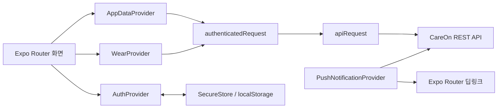

# CareOn Mobile

CareOn의 보호자용 모바일 클라이언트입니다. 웹에서 저장한 복지·지원 제도의 신청 일정과 필요 서류를 모바일에서 확인하고, 연결된 CareOn 워치의 위치·심박수·SOS·안심 구역 이탈 정보를 관리할 수 있습니다.

이 프로젝트는 Expo SDK 54, React Native, TypeScript를 기반으로 하며 Android, iOS, Web을 하나의 코드베이스로 지원합니다. 다만 원격 푸시 알림은 현재 Android만 활성화되어 있으므로 전체 기능을 검증할 때는 Android Development Build를 사용하는 것을 권장합니다.

## 핵심 기능

### 계정과 세션

- CareOn 웹 계정으로 이메일/비밀번호 로그인
- 앱 시작 시 저장된 토큰을 이용한 자동 로그인
- Access Token 만료로 `401`이 발생하면 Refresh Token으로 갱신한 뒤 원래 요청을 한 번 재시도
- 이름, 비밀번호, 서울시 거주 지역, 정책·일반 알림 수신 여부 수정
- 로그아웃 및 회원 탈퇴
- 네이티브 앱에서는 `expo-secure-store`, Web에서는 `localStorage`에 인증 토큰과 푸시 토큰 저장
- 회원가입은 앱 내부가 아니라 [CareOn 웹사이트](https://www.careon.site/)에서 진행

### 정책 캘린더

- 사용자가 웹에서 저장한 제도의 신청 마감일과 결과 발표일 표시
- 신청 마감은 빨간색, 결과 발표는 파란색 일정 점으로 구분
- 모집기간이 상시인 제도는 달력 날짜에 넣지 않고 하단 예정 일정 섹션에 초록색 카드로 표시
- 월 이동, 날짜 선택, 선택 날짜의 일정 상세 오버레이 제공
- 현재 날짜를 기준으로 예정된 일정과 `D-Day`, `D-N` 정보 계산
- 예정 일정 카드를 누르면 해당 제도가 상단에 오도록 투두 화면으로 이동
- 읽지 않은 알림이 있으면 캘린더 상단 알림 아이콘에 표시
- 캘린더 화면이 포커스될 때 저장 제도, 투두, 읽지 않은 알림 수를 서버에서 다시 조회

### 필요 서류 투두

- `남은 제도`와 `신청 완료 제도` 탭으로 분리
- 체크 가능한 제출 서류의 전체 진행률 표시
- 서류 체크 시 화면을 먼저 갱신하는 낙관적 업데이트 적용
- 서버 저장 실패 시 이전 체크 상태로 자동 롤백
- 서버가 `is_checkable: false`로 내려준 안내성 서류는 체크박스 없이 표시
- 마감된 제도는 실제 신청 여부를 확인
  - `예`: 신청 완료 상태로 전환
  - `아니오`: 저장 제도에서 제거
- 백엔드가 제공한 공식 정책 페이지 링크를 외부 브라우저로 열기

### 알림

- 신청 마감 7일·3일·1일 전 알림과 결과 발표일 알림 조회
- 알림 화면 진입 시 서버의 알림 목록을 조회하고 전체 읽음 처리
- 카드를 좌우로 스와이프해 현재 화면 목록에서 제거
- 전체 읽음 버튼으로 현재 목록을 한 번에 비우기
- Android 원격 푸시 알림 지원
  - `emergency`: SOS·안심 구역 이탈용 최고 중요도 채널
  - `policy`: 정책·일반 알림용 기본 중요도 채널
- 마이페이지에서 정책·일반 알림을 끄더라도 기기 토큰은 유지하여 SOS와 안심 구역 이탈 같은 긴급 알림은 계속 수신
- 푸시 데이터의 `url` 값이 `/`로 시작하면 Expo Router 경로로 딥링크
- 로그아웃 시 서버에 등록된 Expo Push Token 해제 시도

알림 화면의 개별 스와이프 제거와 `전체 읽음` 버튼은 현재 화면의 로컬 목록을 정리하는 동작입니다. 서버의 읽음 처리는 알림 화면이 처음 열릴 때 일괄 수행됩니다.

### 실시간 위치

- 서버를 통해 전달되는 CareOn 워치의 최근 위치를 지도에 표시
- 워치 위치, 최근 갱신 시각, GPS 정확도, 추적 종료 예정 시각 제공
- 60분 단위 위치 추적 시작/중지
- 지도를 사용자가 움직이기 전까지 새 워치 위치를 자동으로 따라가기
- 현재 안심 구역이 활성화된 경우 지도에 반경 원 표시
- 실시간 위치 화면이 활성화된 동안 약 3초 간격으로 위치 갱신

실시간 위치의 좌표는 휴대폰 GPS가 아니라 연결된 워치가 백엔드에 전송한 데이터입니다. `expo-location`은 안심 구역의 중심을 편리하게 지정하기 위해 보호자 휴대폰의 현재 위치를 한 번 조회할 때만 사용합니다.

### 워치 연결과 돌봄

- 만료 시각이 있는 6자리 워치 연결 코드 발급
- 연결 코드 남은 시간 초 단위 표시
- 연결된 워치 정보 확인 및 연결 해제
- 등록된 돌봄 대상자의 최근 심박수 확인
- 안심 구역 사용 여부, 이름, 중심 좌표, 반경 설정
- 반경은 `100m`, `150m`, `300m`, `500m` 중 선택
- 워치 SOS 요청과 안심 구역 이탈 이벤트 확인
- SOS 요청 시 요청 시각, 마지막 심박수, 위치 정확도와 지도 표시
- 보호자가 SOS를 확인했음을 서버에 반영
- 안심 구역 이탈 시 감지 시각, GPS 측정 시각, 위치 정확도, 워치 응답 표시
- 전체/SOS/안심 구역 탭으로 돌봄 이력 조회
- 커서 기반 페이지네이션으로 이전 기록 추가 조회
- 이력 카드를 누르면 상세 정보와 위치 지도를 바텀 시트로 표시
- 저장된 좌표를 Google 지도 앱 또는 브라우저로 열기

앱이 포그라운드에 있으면 활성 SOS와 안심 구역 이탈 상태를 약 15초 간격으로 보수적으로 갱신합니다. 긴급 이벤트의 주 전달 수단은 푸시 알림이며, 이 폴링은 누락 가능성을 줄이기 위한 보조 수단입니다.

## 화면과 라우팅

Expo Router의 파일 기반 라우팅을 사용합니다. `(tabs)`는 URL에 포함되지 않는 Route Group이며, 알림과 프로필 편집 화면은 같은 탭 네비게이터 안에 있지만 하단 탭 버튼에서는 숨겨집니다.

| 경로 | 파일 | 역할 |
| --- | --- | --- |
| `/` | `app/index.tsx` | 스플래시 애니메이션, 저장 세션 복원 결과에 따른 분기 |
| `/onboarding` | `app/onboarding.tsx` | 로그인 및 웹 회원가입 링크 |
| `/loading` | `app/loading.tsx` | 로그인 후 전환 화면 |
| `/calendar` | `app/(tabs)/calendar.tsx` | 정책 캘린더와 예정 일정 |
| `/todo` | `app/(tabs)/todo.tsx` | 필요 서류 체크리스트와 신청 완료 관리 |
| `/tracking` | `app/(tabs)/tracking.tsx` | 워치 실시간 위치 |
| `/mypage` | `app/(tabs)/mypage.tsx` | 계정, 알림, 워치 설정 진입점 |
| `/notifications` | `app/(tabs)/notifications.tsx` | 서버 알림 목록 |
| `/profile-name` | `app/(tabs)/profile-name.tsx` | 이름/닉네임 변경 |
| `/profile-password` | `app/(tabs)/profile-password.tsx` | 비밀번호 변경 |
| `/profile-district` | `app/(tabs)/profile-district.tsx` | 서울시 거주 지역 변경 |
| `/wear` | `app/wear/index.tsx` | 워치 연결, 심박수, 긴급 이벤트 관리 |
| `/wear/safe-zone` | `app/wear/safe-zone.tsx` | 안심 구역 설정 |
| `/wear/history` | `app/wear/history.tsx` | SOS·안심 구역 이력 |
| `/emergency/[eventId]` | `app/emergency/[eventId].tsx` | 특정 SOS 이벤트 확인 |
| `/safe-zone-events/[eventId]` | `app/safe-zone-events/[eventId].tsx` | 특정 안심 구역 이탈 이벤트 확인 |
| `/wear-device` | `app/wear-device.tsx` | 기존 경로 호환을 위해 `/wear`로 리다이렉트 |

푸시 서버에서 다음과 같이 내부 경로를 전달하면 해당 이벤트 화면으로 바로 이동할 수 있습니다.

```json
{
  "data": {
    "url": "/emergency/123"
  }
}
```

## 기술 스택

| 분류 | 기술 | 현재 버전/용도 |
| --- | --- | --- |
| Framework | Expo | SDK `~54.0.34` |
| UI | React / React Native | React `19.1.0`, React Native `0.81.5` |
| Language | TypeScript | `~5.9.2`, strict mode |
| Routing | Expo Router | `~6.0.23`, Typed Routes 사용 |
| Navigation | React Navigation | Bottom Tabs, 화면 포커스 이벤트 |
| Map | react-native-maps | `1.20.1`, Android Google Maps / iOS 기본 Apple Maps |
| Location | expo-location | 안심 구역 중심 설정용 포그라운드 위치 |
| Push | expo-notifications | Android 채널, Expo Push Token, 딥링크 |
| Secure Storage | expo-secure-store | 네이티브 토큰 보관 |
| Animation | React Native Animated / Reanimated | 스플래시, 탭 인디케이터, 바텀 시트, 진입 애니메이션 |
| Image | expo-image | 로고와 알림 이미지 |
| Build | EAS Build | development, preview, production 프로필 |
| Quality | ESLint | `eslint-config-expo` |

Expo SDK 54의 공식 호환 기준은 Node.js `20.19.x` 이상, Android 7 이상, iOS 15.1 이상입니다. SDK 54는 React Native 0.81과 React 19.1을 기준으로 합니다.

## 애플리케이션 구조

```text
.
├── app/                         # Expo Router 화면과 레이아웃
│   ├── (tabs)/                  # 하단 탭 및 탭 내부 화면
│   ├── emergency/[eventId].tsx  # SOS 동적 경로
│   ├── safe-zone-events/        # 안심 구역 이탈 동적 경로
│   └── wear/                    # 워치, 안심 구역, 돌봄 이력
├── assets/images/               # 앱 아이콘, 스플래시, 알림 이미지
├── components/careon/           # CareOn 공통 화면·입력·버튼 컴포넌트
├── constants/                   # 기본 테마 상수
├── hooks/                       # 플랫폼별 테마 훅
├── lib/
│   ├── api.ts                   # HTTP 클라이언트, DTO 타입과 변환
│   ├── auth-state.tsx           # 인증 상태, 토큰 갱신, 사용자 정보
│   ├── app-data-state.tsx       # 정책·캘린더·투두·알림 상태
│   ├── wear-state.tsx           # 워치·위치·안심 구역·긴급 이벤트 상태
│   ├── push-notification-state.tsx
│   ├── token-storage.ts         # SecureStore/localStorage 추상화
│   ├── save-feedback-state.tsx  # 저장 완료 토스트
│   └── careon-theme.ts          # CareOn 색상과 그림자 토큰
├── app.json                     # Expo 정적 앱 설정과 Config Plugin
├── app.config.ts                # 환경변수를 반영하는 동적 앱 설정
├── eas.json                     # EAS Build/Submit 프로필
└── package.json                 # 실행 스크립트와 의존성
```

`lib/mock-data.ts`, `lib/checklist-state.tsx`, `lib/notification-state.tsx`에는 초기 개발용 데이터와 상태 코드가 일부 남아 있습니다. 현재 루트 Provider와 주요 정책 화면은 `AppDataProvider` 및 실제 API 응답을 사용하며, `mock-data.ts`의 서울시 자치구 목록은 거주지 선택 화면에서 사용합니다.

## 상태 관리와 데이터 흐름

별도 전역 상태 라이브러리 없이 React Context와 Hooks로 상태를 구성합니다.



`app/_layout.tsx`의 Provider 순서는 다음과 같습니다.

1. `AuthProvider`: 토큰과 사용자 세션을 먼저 복원
2. `PushNotificationProvider`: 인증 후 Android 푸시 토큰 등록
3. `SaveFeedbackProvider`: 저장 완료 토스트 제공
4. `AppDataProvider`: 저장 제도, 캘린더, 투두, 알림 상태 제공
5. `WearProvider`: 돌봄 대상자, 워치, 위치, 긴급 이벤트 상태 제공

### 인증 요청 처리

`lib/api.ts`의 `apiRequest`가 공통 HTTP 처리를 담당합니다.

- `EXPO_PUBLIC_API_BASE_URL`과 API 경로 결합
- JSON 요청/응답 처리
- Access Token이 있으면 `Authorization: Bearer <token>` 헤더 추가
- 성공하지 않은 응답은 서버의 `message`를 포함한 `ApiError`로 변환
- 서버의 `snake_case` 사용자/인증 DTO를 앱의 `camelCase` 모델로 정규화

`AuthProvider.authenticatedRequest`는 인증이 필요한 모든 요청의 진입점입니다.

1. 현재 Access Token으로 요청
2. `401`이면 진행 중인 토큰 갱신 Promise를 공유하여 중복 Refresh 요청 방지
3. 새 Access Token으로 원래 요청 한 번 재시도
4. Refresh 또는 재시도도 실패하면 로컬 세션 제거

### 정책 데이터 동기화

`AppDataProvider.refreshData`는 다음 요청을 병렬 실행합니다.

- 저장 제도 목록
- 필요 서류 투두 목록
- 읽지 않은 알림 수

API 응답은 캘린더 이벤트, 예정 일정 카드, 투두 카드에 맞는 화면 모델로 변환됩니다. 캘린더와 투두 탭은 화면 포커스 시 데이터를 새로 고칩니다.

### 워치 데이터 동기화

`WearProvider`는 인증 후 돌봄 대상자와 워치 연결 상태를 조회합니다. 현재 별도의 돌봄 대상자 선택 UI는 없으며, 이전에 선택된 대상자가 없으면 서버 목록의 첫 번째 대상을 사용합니다.

- 앱이 활성 상태일 때 워치·긴급 상태: 약 15초 간격
- 실시간 위치 화면이 활성 상태일 때 워치 위치: 약 3초 간격
- 앱이 백그라운드로 이동하면 위 폴링 중지
- 실시간 추적 시작 시 서버에 기본 60분 만료 시간을 요청
- 전체 돌봄 이력 탭은 SOS 이력과 안심 구역 이탈 이력을 각각 조회한 뒤 클라이언트에서 시간순으로 병합

## 주요 API 계약

모든 경로는 `EXPO_PUBLIC_API_BASE_URL` 뒤에 붙으며, 로그인과 토큰 갱신 이외의 요청은 Bearer Token이 필요합니다.

### 인증과 사용자

| Method | Endpoint | 용도 |
| --- | --- | --- |
| `POST` | `/api/app/users/login` | 로그인과 Access/Refresh Token 발급 |
| `POST` | `/api/app/users/refresh` | Refresh Token으로 토큰 갱신 |
| `POST` | `/api/app/users/logout` | 서버 세션 로그아웃 |
| `GET` | `/api/app/users/me` | 내 프로필 조회 |
| `PATCH` | `/api/app/users/me` | 이름, 비밀번호, 지역, 알림 설정 수정 |
| `DELETE` | `/api/app/users/me` | 회원 탈퇴 |
| `PUT` | `/api/app/users/me/push-tokens` | Expo Push Token 등록/갱신 |
| `DELETE` | `/api/app/users/me/push-tokens` | Expo Push Token 해제 |

### 저장 정책, 투두, 알림

| Method | Endpoint | 용도 |
| --- | --- | --- |
| `GET` | `/api/app/users/me/saved-policies` | 저장 제도와 일정 조회 |
| `DELETE` | `/api/app/users/me/saved-policies/:id` | 저장 제도 제거 |
| `POST` | `/api/app/users/me/saved-policies/:id/applied` | 신청 완료 처리 |
| `GET` | `/api/app/users/me/todos` | 제도별 필요 서류 조회 |
| `PATCH` | `/api/app/users/me/todos/:todoId` | 서류 체크 상태 변경 |
| `GET` | `/api/app/users/me/notifications` | 알림 목록 조회 |
| `GET` | `/api/app/users/me/notifications/unread-count` | 읽지 않은 알림 수 조회 |
| `PATCH` | `/api/app/users/me/notifications/read-all` | 모든 알림 읽음 처리 |

### 워치와 돌봄

| Method | Endpoint | 용도 |
| --- | --- | --- |
| `GET` | `/api/app/users/me/cared` | 돌봄 대상자 목록 |
| `GET` / `DELETE` | `/api/app/wear-device` | 연결 워치 조회/해제 |
| `POST` | `/api/app/wear-pairing-codes` | 워치 연결 코드 발급 |
| `GET` | `/api/app/wear/live-location` | 워치 최근 위치와 추적 상태 |
| `PATCH` | `/api/app/wear/live-location/tracking` | 실시간 위치 추적 시작/중지 |
| `GET` / `PUT` | `/api/app/cared/:caredId/safe-zone` | 안심 구역 조회/저장 |
| `GET` | `/api/app/cared/:caredId/heart-rates/latest` | 최근 심박수 |
| `GET` | `/api/app/cared/:caredId/emergency-events/active` | 현재 활성 SOS |
| `GET` | `/api/app/emergency-events/:eventId` | 특정 SOS 상세 |
| `PATCH` | `/api/app/emergency-events/:eventId/acknowledge` | SOS 보호자 확인 |
| `GET` | `/api/app/cared/:caredId/emergency-events` | SOS 이력 |
| `GET` | `/api/app/cared/:caredId/safe-zone-events/active` | 현재 활성 안심 구역 이탈 |
| `GET` | `/api/app/safe-zone-events/:eventId` | 특정 이탈 이벤트 상세 |
| `GET` | `/api/app/cared/:caredId/safe-zone-events` | 안심 구역 이탈 이력 |

이력 API는 `cursor`와 `limit` 쿼리를 사용하는 커서 페이지네이션이며, 응답의 `next_cursor`가 없을 때 마지막 페이지로 판단합니다.

## 개발 환경 준비

### 1. 요구 사항

- Node.js `20.19.x` 이상
- npm
- Android 개발 시 Android Studio와 Android SDK
- iOS 개발 시 macOS와 Xcode
- 원격 EAS Build 사용 시 Expo 계정
- 실행 가능한 CareOn 백엔드 API
- Android 지도 배포 시 Maps SDK for Android가 활성화된 Google Maps API Key
- Android 푸시 검증 시 Firebase Android 앱 설정 파일과 FCM 자격 증명

### 2. 의존성 설치

`package-lock.json`과 동일한 의존성을 설치하려면 다음 명령을 사용합니다.

```bash
npm ci
```

### 3. 환경변수 설정

로컬 설정 파일을 생성합니다.

```bash
cp .env.example .env.local
```

예시:

```dotenv
EXPO_PUBLIC_API_BASE_URL=https://api.example.com
EXPO_PUBLIC_EAS_PROJECT_ID=24abe3c4-0d44-4d40-8b62-2111838a925b

GOOGLE_MAPS_ANDROID_API_KEY=YOUR_ANDROID_MAPS_KEY
GOOGLE_MAPS_IOS_API_KEY=
```

| 변수 | 필수 여부 | 설명 |
| --- | --- | --- |
| `EXPO_PUBLIC_API_BASE_URL` | 필수 | CareOn 백엔드 Origin. 마지막 `/`는 있어도 앱에서 제거 |
| `EXPO_PUBLIC_EAS_PROJECT_ID` | Android 푸시 권장 | Expo Push Token을 프로젝트에 귀속. 없으면 `app.json`의 EAS Project ID 사용 |
| `GOOGLE_MAPS_ANDROID_API_KEY` | Android 독립 빌드의 지도에 필요 | `android.config.googleMaps.apiKey`로 주입 |
| `GOOGLE_MAPS_API_KEY` | 선택 | Android 키의 호환용 대체 변수 |
| `GOOGLE_MAPS_IOS_API_KEY` | 현재 선택 | iOS에서 Google Maps Provider를 명시적으로 도입할 때 사용할 키 |
| `GOOGLE_SERVICES_JSON` | EAS Android 푸시 빌드 | EAS File 환경변수로 업로드한 `google-services.json`의 빌드 서버 경로 |

`EXPO_PUBLIC_` 변수는 앱 번들에 평문으로 포함됩니다. API 비밀키, 서버 비밀키, Firebase Admin 키와 같은 민감 정보를 넣으면 안 됩니다.

Android Maps API Key도 최종 앱 바이너리에서 완전히 숨길 수 있는 값이 아닙니다. Google Cloud Console에서 Android 패키지 `site.careon.mobile`과 빌드 인증서 SHA-1로 사용 범위를 제한해야 합니다.

### 4. Firebase Android 설정

로컬 Android Development Build에서는 Firebase Console에서 내려받은 파일을 프로젝트 루트에 다음 이름으로 둡니다.

```text
google-services.json
```

이 파일은 `.gitignore`에 포함되어 있으므로 Git에 커밋하지 않습니다.

EAS Build에서는 `google-services.json`을 `GOOGLE_SERVICES_JSON`이라는 File 환경변수로 등록합니다. `app.config.ts`가 EAS 빌드 서버에서 제공하는 파일 경로를 `android.googleServicesFile`에 연결합니다. EAS 환경변수는 `development`, `preview`, `production` 환경별로 각각 관리하는 것을 권장합니다.

### 5. 개발 서버 실행

```bash
npm start
```

동일한 명령:

```bash
npx expo start
```

터미널에서 `a`는 Android, `i`는 iOS Simulator, `w`는 Web을 엽니다.

Expo Go에서도 대부분의 JavaScript UI와 `react-native-maps`를 확인할 수 있지만, SDK 53 이상 Android Expo Go에서는 원격 푸시 알림을 사용할 수 없습니다. 푸시 토큰 발급, 알림 탭 딥링크, 네이티브 Config Plugin 설정은 Development Build에서 검증해야 합니다.

### 6. 로컬 Development Build

Android:

```bash
npm run android
```

iOS:

```bash
npm run ios
```

위 스크립트는 각각 `expo run:android`, `expo run:ios`를 실행합니다. 네이티브 폴더가 없으면 Expo Prebuild가 설정과 Config Plugin을 바탕으로 `android/`, `ios/`를 생성합니다.

앱 설정, Config Plugin, 네이티브 모듈, Expo SDK 버전을 변경한 경우에는 네이티브 프로젝트를 다시 생성하고 빌드해야 합니다.

```bash
npx expo prebuild --clean
npm run android
```

`prebuild --clean`은 생성된 네이티브 폴더를 다시 만드는 명령이므로, 네이티브 폴더를 직접 수정한 경우에는 변경 사항을 먼저 보존해야 합니다.

### 7. EAS Build

프로젝트에는 다음 프로필이 이미 정의되어 있습니다.

| 프로필 | 설정 | 용도 |
| --- | --- | --- |
| `development` | Development Client, internal distribution | 개발·디버깅 |
| `preview` | internal distribution | QA와 내부 배포 |
| `production` | 버전 자동 증가 | 스토어 제출용 |

EAS CLI 로그인:

```bash
npx eas-cli@latest login
```

Android Development Build:

```bash
npx eas-cli@latest build --profile development --platform android
```

Preview Build:

```bash
npx eas-cli@latest build --profile preview --platform android
```

Production Build:

```bash
npx eas-cli@latest build --profile production --platform android
npx eas-cli@latest build --profile production --platform ios
```

## npm 스크립트

| 명령 | 설명 |
| --- | --- |
| `npm start` | Expo 개발 서버 시작 |
| `npm run android` | Android 네이티브 Development Build 생성/실행 |
| `npm run ios` | iOS 네이티브 Development Build 생성/실행 |
| `npm run web` | Web 개발 서버 시작 |
| `npm run lint` | Expo ESLint 실행 |
| `npm run reset-project` | 기본 Expo 예제 초기화 스크립트 실행 |

`reset-project`는 현재 CareOn 화면을 초기화하는 용도의 스크립트이므로 일반 개발 과정에서는 실행하지 마세요.

## 플랫폼별 동작과 권한

### Android

- 전체 기능의 우선 지원 플랫폼
- Google Maps 사용
- 원격 푸시 알림 및 Expo Push Token 등록 활성화
- Android 13 이상에서는 알림 권한 필요
- `emergency` 채널을 토큰 발급 전에 생성하여 긴급 알림의 소리·진동·중요도 설정
- Edge-to-edge 활성화

### iOS

- `react-native-maps`의 기본 Apple Maps 사용
- 현재 `PushNotificationProvider`가 iOS 토큰 등록을 의도적으로 건너뛰므로 원격 푸시 미지원
- 안심 구역 중심 설정 시 `When In Use` 위치 권한 사용
- iPad 지원 설정 활성화

### Web

- Expo Router 정적 출력 설정
- SecureStore 대신 브라우저 `localStorage` 사용
- 지도, 위치 권한, 외부 링크, 알림 등은 브라우저와 네이티브 간 동작 차이가 있음
- Web에서 API를 호출하려면 백엔드 CORS 설정 필요

### 위치 권한 범위

앱이 요청하는 권한은 포그라운드 위치 권한입니다.

- 용도: 보호자 휴대폰의 현재 좌표를 안심 구역 중심으로 선택
- 백그라운드 위치 추적: 사용하지 않음
- 워치 실시간 위치: 워치 → 백엔드 → 모바일 앱 경로로 조회
- 현재 위치 조회가 20초 안에 완료되지 않으면 최근 1시간 이내, 정확도 100m 이내의 마지막 위치를 대체값으로 시도
- 권한 거부 또는 위치 서비스 비활성화 시 사용자가 지도를 직접 움직여 중심 지정 가능

## 검증

코드 정적 검사를 실행합니다.

```bash
npm run lint
```

환경변수가 반영된 최종 Expo Public Config를 확인합니다.

```bash
npx expo config --type public
```

현재 `package.json`에는 자동화 테스트 스크립트가 없습니다. 주요 기능 변경 시 다음 항목을 실제 기기 또는 에뮬레이터에서 수동 검증하는 것을 권장합니다.

1. 로그인, 앱 재실행 후 자동 로그인, 토큰 갱신
2. 캘린더 일정과 투두 제도의 연결
3. 서류 체크 성공 및 네트워크 실패 시 롤백
4. 알림 조회, 읽음 표시, 카드 스와이프
5. 워치 연결 코드 발급·만료·연결 해제
6. 안심 구역 현재 위치 권한, 지도 이동, 반경 저장
7. 실시간 위치 시작·중지와 3초 폴링
8. SOS/안심 구역 푸시를 통한 동적 경로 진입
9. 긴급 이벤트 상세 조회 실패, `404`, 재시도 화면
10. 로그아웃·회원 탈퇴 후 토큰과 화면 상태 정리

## 문제 해결

### `EXPO_PUBLIC_API_BASE_URL 환경변수를 설정해주세요`

`.env.local`에 API 주소가 있는지 확인하고 앱을 전체 Reload 합니다.

실기기에서 로컬 백엔드의 `localhost`는 개발 PC가 아니라 휴대폰 자신을 가리킵니다. 동일 네트워크의 PC IP 또는 외부에서 접근 가능한 HTTPS 주소를 사용해야 합니다. Android Emulator에서는 환경에 따라 `10.0.2.2`로 호스트 PC에 접근할 수 있습니다.

### Android 지도가 비어 있음

다음을 확인합니다.

- Google Cloud에서 Maps SDK for Android 활성화
- `GOOGLE_MAPS_ANDROID_API_KEY` 설정
- API Key 제한에 `site.careon.mobile` 패키지와 올바른 SHA-1 등록
- 환경변수 변경 후 네이티브 앱 재빌드

Expo Go 지도 테스트에는 별도 설정이 필요하지 않을 수 있지만, 독립 앱 바이너리에는 올바른 Google Maps 설정이 필요합니다.

### Android 푸시 토큰이 등록되지 않음

- Expo Go가 아니라 Development Build인지 확인
- Google Play Services를 지원하는 실제 기기 또는 에뮬레이터 사용
- Android 알림 권한 허용
- EAS Project ID 확인
- `google-services.json` 또는 `GOOGLE_SERVICES_JSON` 확인
- Firebase/FCM v1 자격 증명 확인
- 백엔드의 `PUT /api/app/users/me/push-tokens` 응답 확인

### 현재 위치를 가져오지 못함

- 앱의 포그라운드 위치 권한 확인
- 기기 위치 서비스 활성화
- 에뮬레이터에 테스트 좌표 설정
- 최근 위치 대체값도 없으면 지도를 직접 움직여 안심 구역 중심 지정

### Metro 캐시 문제

```bash
npx expo start --clear
```

## 현재 구현 시 주의점

- Android 원격 푸시만 구현되어 있으며 iOS APNs 등록 흐름은 비활성화되어 있습니다.
- 캘린더 초기 표시 월은 현재 코드에서 `2026년 7월`로 고정되어 있습니다.
- 정책 알림 카드를 누르면 현재는 정책 상세가 아니라 캘린더로 돌아갑니다. `policyId`, `servId`를 활용한 상세 연결은 후속 구현 대상입니다.
- 비밀번호 변경 화면은 새 비밀번호와 확인값의 일치 여부를 검사하지만, 현재 비밀번호 입력값을 API Payload에 포함하지 않습니다. 재인증이 필요하다면 백엔드 계약과 함께 보완해야 합니다.
- 돌봄 대상자가 여러 명이어도 현재 선택 UI가 없으며 첫 번째 대상을 기본으로 사용합니다.
- 데이터 오프라인 캐시가 없으므로 정책·워치 기능에는 백엔드 연결이 필요합니다.
- Web의 토큰은 `localStorage`에 저장되므로 네이티브 SecureStore와 동일한 보안 수준이 아닙니다.
- 실시간 위치 폴링은 앱이 포그라운드이고 해당 화면이 활성화된 동안에만 수행됩니다.

## 보안 유의사항

- `EXPO_PUBLIC_` 변수에는 비밀값을 저장하지 않습니다.
- Access Token, Refresh Token, Expo Push Token을 로그에 출력하지 않습니다.
- `google-services.json`, 키스토어, APNs 키, Firebase Admin 키를 Git에 커밋하지 않습니다.
- Google Maps API Key에는 Android 앱 제한과 API 제한을 적용합니다.
- 긴급 이벤트, 위치, 심박 데이터는 민감정보이므로 백엔드에서 보호자와 돌봄 대상자의 관계를 반드시 검증해야 합니다.
- 푸시 딥링크는 앱에서 `/`로 시작하는 내부 경로만 허용하지만, 백엔드에서도 허용 경로와 이벤트 접근 권한을 검증해야 합니다.

## 참고 문서

이 프로젝트는 Expo SDK 54 기준으로 구현되어 있습니다.

- [Expo SDK 54 Reference](https://docs.expo.dev/versions/v54.0.0/)
- [Expo Router — SDK 54](https://docs.expo.dev/versions/v54.0.0/sdk/router/)
- [Expo Notifications — SDK 54](https://docs.expo.dev/versions/v54.0.0/sdk/notifications/)
- [Expo Location — SDK 54](https://docs.expo.dev/versions/v54.0.0/sdk/location/)
- [Expo SecureStore — SDK 54](https://docs.expo.dev/versions/v54.0.0/sdk/securestore/)
- [react-native-maps — SDK 54](https://docs.expo.dev/versions/v54.0.0/sdk/map-view/)
- [Expo App Config — SDK 54](https://docs.expo.dev/versions/v54.0.0/config/app/)
- [Expo 환경변수](https://docs.expo.dev/guides/environment-variables/)
- [Expo Development Build](https://docs.expo.dev/develop/development-builds/introduction/)
- [Expo Push Notification 설정](https://docs.expo.dev/push-notifications/push-notifications-setup/)
- [EAS 환경변수](https://docs.expo.dev/eas/environment-variables/)
